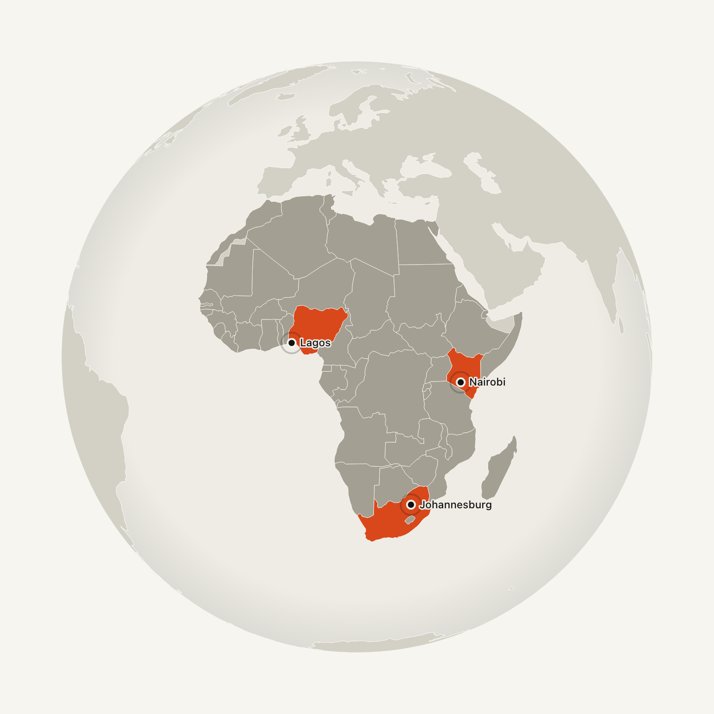
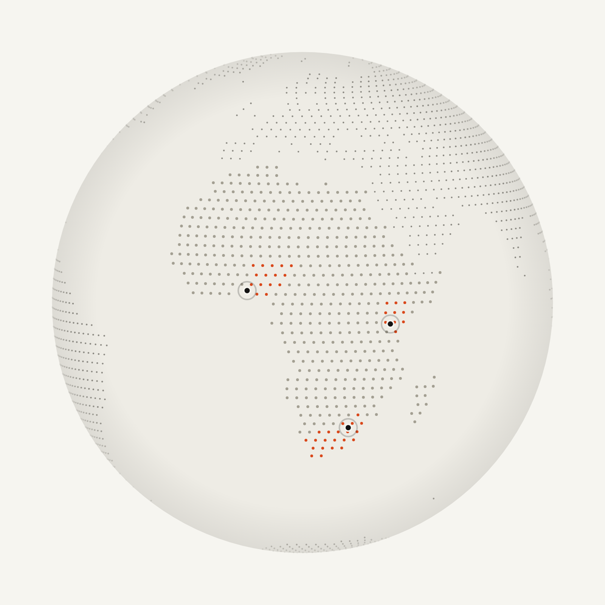
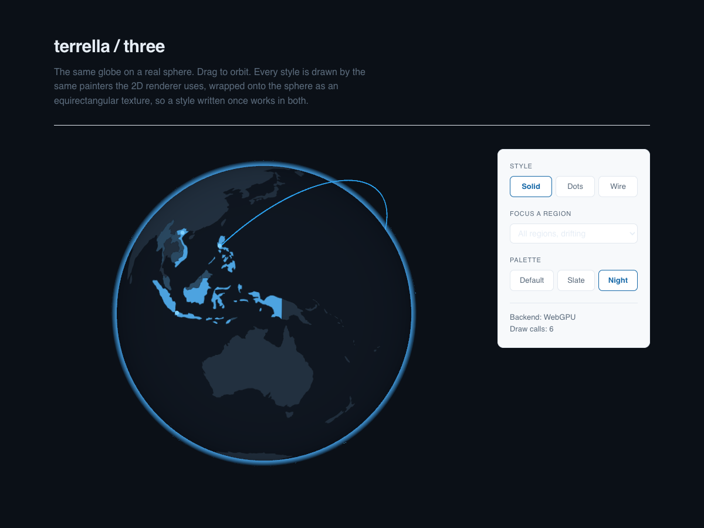

# terrella

An interactive globe for the web. Highlight countries and regions, place
markers, and choose how it looks.

A terrella is a small model of the Earth. William Gilbert built one in 1600 to
study magnetism, which is roughly what this is.

<p align="center">
  
  
</p>

```sh
npm install terrella
```

```js
import { createGlobe } from "terrella";
import world from "world-atlas/countries-110m.json";

const globe = createGlobe(document.querySelector("#globe"), {
  world,
  regions: [
    { id: "sea", name: "Southeast Asia", countries: [608, 360, 704] },
  ],
  markers: [
    { name: "Manila", coords: [121.0, 14.6], country: 608, timezone: "Asia/Manila" },
  ],
});

globe.focus("sea");
```

Drag to spin, flick to throw, hover a marker for its local time.

## Why this exists

Most lightweight globe libraries do markers and arcs but cannot highlight
countries. The ones that can are built on three.js and cost hundreds of
kilobytes. terrella is the middle: country and region highlighting on a 2D
canvas, with d3-geo doing the projection maths.

The fiddly parts are the same in every hand-rolled globe, and they are what
this actually solves:

- Which country ids the atlas uses, and the fact that yours are probably not
  padded the same way.
- Hiding markers once they pass the horizon, because an orthographic
  projection happily projects the far side of the world onto the near side.
- Making a drag feel like a throw rather than a jump.
- Not animating at all when someone has asked their machine to stop moving.
- Aiming the camera at a region without working the angle out by hand.

## Styles

Three built in. Pass `style` at construction or call `setStyle` later.

| Style | What it draws |
| --- | --- |
| `solid` | Flat country fills with hairline seams. The default. |
| `dots` | Land as a field of dots, fading toward the limb. |
| `wireframe` | Coastlines over a graticule. |

```js
globe.setStyle("dots");
```

Write your own by passing an object instead of a name. `prepare` runs once and
whatever it returns is handed to every `paint`:

```js
globe.setStyle({
  name: "my-style",
  prepare: ({ land, countries }) => ({ /* expensive work, once */ }),
  paint: (frame, state) => {
    frame.ctx.fillStyle = frame.palette.land;
    frame.ctx.beginPath();
    frame.path(frame.land);
    frame.ctx.fill();
  },
});
```

## Projections

`orthographic` (a globe, the default), `equirectangular` and `naturalEarth`
(flat maps). Everything else works the same in all three.

```js
globe.setProjection("naturalEarth");
```

## Regions

A region is a group of ISO 3166-1 numeric country ids treated as one thing.
Ids can be numbers or strings, padded or not.

```js
{
  id: "africa",
  name: "Africa",
  countries: [566, 404, 710, 818],
  highlight: [566],          // a subset, painted in highlightColor
  color: "#a9cdec",
  highlightColor: "#2ea6f5",
}
```

`focus(id)` parks that region facing the viewer and stops the drift. If the
region has no `longitude`, the camera aims at the centroid of its countries,
computed as a vector average so a region spanning the antimeridian does not end
up centred on the Atlantic. `focus(null)` releases it.

## Colours

Every colour is in one palette object, and any subset can be overridden.

```js
globe.setPalette({ ocean: "#f1f4f7", land: "#c6ced8", highlight: "#3c5570" });
```

Two entries are derived rather than required. A colour that reads well as a
filled continent disappears as scattered dots, so the `dots` style pushes
`land` away from `ocean` unless you set `dot` yourself, and `wireframe` does
the same for its coastline unless you set `outline`. The direction follows the
background's luminance, so this works on a dark palette too.

## API

```ts
createGlobe(element, options) => GlobeInstance
```

| Option | Default | |
| --- | --- | --- |
| `world` | required | TopoJSON with a `countries` object |
| `style` | `"solid"` | Name or your own painter |
| `projection` | `"orthographic"` | |
| `regions` | `[]` | |
| `markers` | `[]` | |
| `arcs` | `[]` | Great-circle lines between two points |
| `palette` | see above | Any subset |
| `spin` | `3.2` | Degrees per second; 0 holds still |
| `tilt` | `-14` | Degrees of axial tilt |
| `longitude` | `18` | Starting longitude at the centre |
| `ratio` | `1` | Canvas height as a multiple of its width |
| `radius` | `0.46` | Sphere radius as a fraction of width |
| `draggable` | `true` | |
| `tooltips` | `true` | |
| `pulseMs` | `1600` | Marker pulse period; 0 disables |
| `respectReducedMotion` | `true` | Draw one still frame instead of animating |
| `dotSpacing` | `2.2` | Degrees between dots in the `dots` style |
| `dotSize` | `1.1` | Dot radius in pixels |
| `label` | derived | Overrides the canvas aria-label |
| `locale` | browser | For marker clock formatting |
| `onMarkerHover` | | `(marker \| null) => void` |
| `onMarkerClick` | | `(marker, event) => void` |

The instance exposes `focus`, `setStyle`, `setProjection`, `setPalette`,
`setSpin`, `setMarkers`, `longitude`, `canvas` and `destroy`.

## 3D

A second entry point renders the same globe on a real sphere. three.js is an
optional peer dependency, so the 2D build stays 7KB for the pages that only
want that.

```sh
npm install terrella three
```

```js
import { createGlobe } from "terrella/three";

const globe = await createGlobe(element, { world, regions, markers, arcs });
```



It is async because `WebGPURenderer` needs `await renderer.init()`. The
renderer picks WebGPU where the browser has it and falls back to WebGL2
everywhere else, from one codebase; `globe.usingWebGL` reports which it got.
Both paths are verified rendering.

The API is otherwise the same, and that is not a coincidence: **both renderers
drive the same style painters.** The 2D one paints to the visible canvas, and
the 3D one paints the identical thing into an equirectangular texture and wraps
it around the sphere. So `solid`, `dots`, `wireframe` and any style you write
yourself all work in 3D the day they are written, and the two renderers cannot
drift apart in how they draw a country.

`setProjection` is the one exception. It throws, because a sphere is the
projection; use the 2D renderer for flat maps.

| Extra option | Default | |
| --- | --- | --- |
| `background` | transparent | Colour behind the globe |
| `atmosphere` | `1` | Rim strength; 0 removes it |
| `atmosphereColor` | `#4db2ff` | |
| `lit` | `false` | Shade with a light instead of showing the map flat |
| `zoom` | `false` | Wheel zoom |
| `textureSize` | `2048` | Texture width; height is half |
| `forceWebGL` | `false` | Force the fallback backend, to reproduce a bug |

Markers hover in 3D as they do in 2D: the same tooltip, the same local clock,
the same `onMarkerHover` and `onMarkerClick` callbacks.

The part worth knowing is occlusion. A raycast against the markers alone
happily hits one on the far side of the planet, so the cursor picks up a city
that is behind the globe and the tooltip appears over empty ocean. The sphere
is therefore included in the raycast and a marker only counts when nothing is
in front of it. Verified in a browser: every near-side marker is hoverable and
none of the far-side ones leak through.

Markers are also a few pixels across, so hit-testing uses a larger invisible
copy of them. Invisible objects are still raycastable, because three tests
`object.layers` and never `object.visible`.

The instance also exposes `scene`, `camera`, `renderer` and `controls`, so
anything three.js can do to a scene you can still do.

Markers are one `InstancedMesh`, so a hundred of them is one draw call rather
than a hundred. Arcs are tubes following a great circle, because WebGL ignores
line width on most platforms and geometry is the only way to control it. The
demo scene runs in 6 draw calls and about 18,000 triangles.

Two notes on how it is shaded, both of which were wrong first. The map is
darkened toward the limb, and that shading rather than the atmosphere is what
makes it read as a sphere: a flat diagrammatic texture has no shading of its
own, so without it the silhouette is the only depth cue and the result looks
like a sticker. And the atmosphere's alpha falls to zero **at** the shell's
silhouette rather than peaking there, or it draws a hard outline exactly where
it stops existing.

## Data

Any TopoJSON with a `countries` object works. `world-atlas`'s `countries-110m`
is the usual one, and a copy is in `data/` so the demo runs without a network.

## From a CDN

`dist/terrella.global.js` bundles d3-geo and topojson-client into one file that
defines `window.terrella`, so a plain HTML page needs no build step. The `npm`
build keeps them external so an app already using d3 does not ship it twice.

## Accessibility

The canvas carries `role="img"` and a generated label naming the regions.
`prefers-reduced-motion` draws a single still frame and disables dragging.
Nothing here is keyboard-operable yet, which is the main gap.

## Performance

The land dots need to know which grid points are on land. Doing that with
`geoContains` took 2.4 seconds at the default spacing and 65 seconds at a tight
one, all on the main thread. The land is instead rasterised once into a small
offscreen bitmap, after which each test is one array read: the same work is now
about 6ms. Total dots are capped at 40,000, because past that it stops reading
as a globe and starts costing frames.

Countries are drawn from one merged land shape rather than 177 separate fills,
and only the countries belonging to a region are painted individually.

## Known gaps

- No keyboard control.
- Antarctica can overflow the ocean shape slightly in flat projections.
- Zoom is not implemented; the sphere is a fixed size.
- No satellite or topographic texture support yet. The sphere is drawn from the
  vector map, which is the point, but a photographic option would be useful.

## Development

```sh
npm install
npm test          # vitest
npm run typecheck
npm run build
npm run demo      # then open http://localhost:8080/demo/
```

## Licence

MIT.
